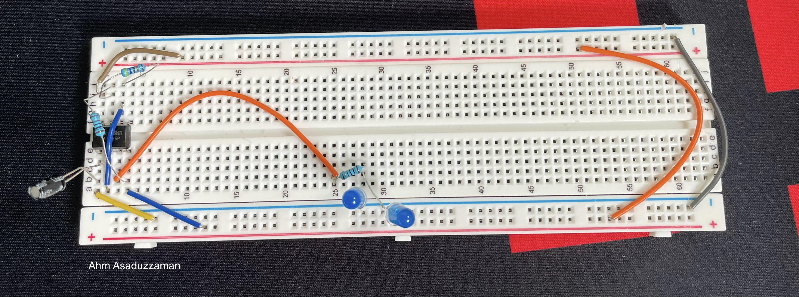

# transistors
The Joy of Tinkering with Transistors

# Tasks   
Transistors: Tinkering with following ideas
- How to Connect a Transistor as a Switch in a Circuit   
- How to Build an Inverter with a Transistor 
- How to Connect a Transistor in a Circuit for Current Amplification 
- How to Build a Voltage Amplifier Circuit with a Transistor 
- How to Build an Emitter Follower Circuit 
- How to Build a Buffer Circuit with a Transistor BJTs 
- How to Connect a PNP Transistor in a Circuit MOSFETS 
- How to Build an N-Channel MOSFET Switch Circuit 
- How to Build a P-Channel MOSFET Switch Circuit JFETs 
- How to Build an N-Channel JFET Switch Circuit 
- How to Build a P-Channel JFET Switch Circuit
- how to build a delay circuit with ic555 (and with a BJT transistor)

  

## It is good have a 2-channel Oscilloscope

 

##  Delay (10sec) circuit wth ic555
The standard 555 package includes 25 transistors, 2 diodes and 15 resistors on a silicon chip installed in an 8-pin dual in-line package (DIP-8)

 

Here, the output of a 555 timer are square waves. There are 3 important time measurements for a square wave. There is the total length of the square wave (the time it is on and off or high and low), there is the length of time it is high (Thigh), and the length of time it is low (Tlow). The total time of a square wave is equal to the sum of Tlow and Thigh. The amount of time that the square wave is high is its duty cycle. So, for example, if the total time of a square wave is 1 second and it's high for 0.2s, it has a duty cycle of 20%, because it's on for only 20% of the cycle.   

The duty cycle is very important for an application like this LED flasher circuit. The duty cycle we choose determines how long the LED will stay on for compared to how long it is off for. Again, as an example, if we set our duty cycle to be 20%, this means the LED will flash on for 20% of the cycle and be off for 80% of the cycle. If we choose a duty cycle of 80%, the LED will be on for 80% of the cycle and off for 20% of the cycle. Thus, our duty cycle is very important.   

The formulas to calculate these values in our circuit is:   

T= 0.7 * (R1 + 2R2) * C1   

Thigh= 0.7 * (R1 + R2) * C1  

Tlow= 0.7 * R2 * C1    

 
