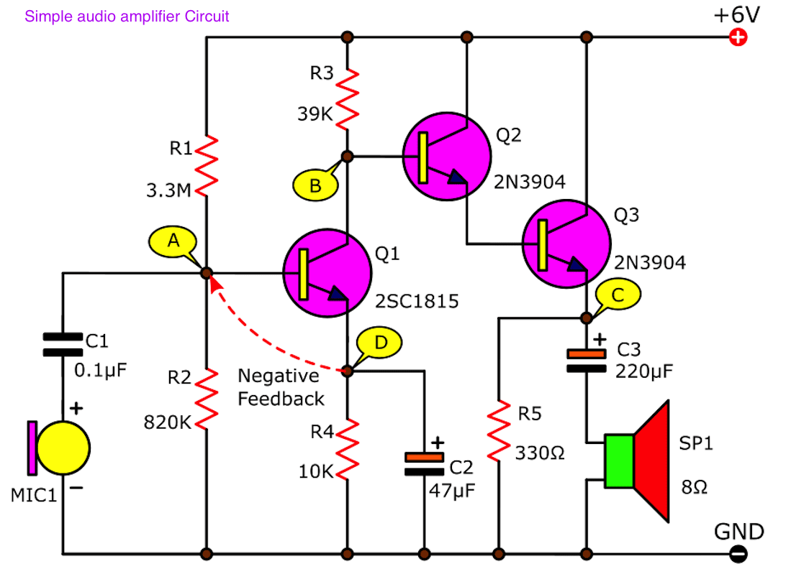
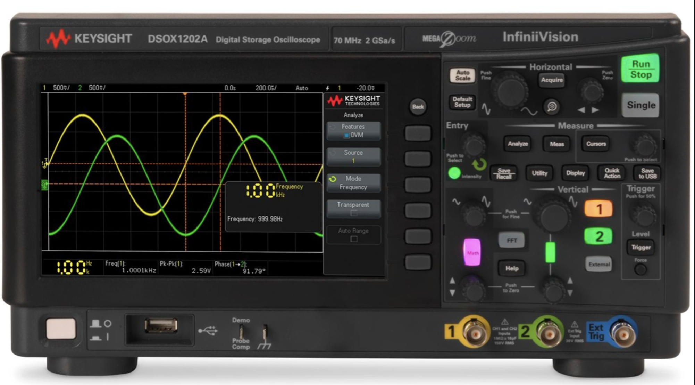
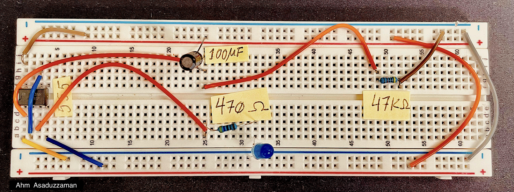

# transistors
The Joy of Tinkering with Transistors

# Tasks   
Transistors: Tinkering with following ideas
- How to Connect a Transistor as a Switch in a Circuit   
- How to Build an Inverter with a Transistor 
- How to Connect a Transistor in a Circuit for Current Amplification 
- How to Build a Voltage Amplifier Circuit with a Transistor 
- How to Build an Emitter Follower Circuit 
- How to Build a Buffer Circuit with a Transistor BJTs 
- How to Connect a PNP Transistor in a Circuit MOSFETS 
- How to Build an N-Channel MOSFET Switch Circuit 
- How to Build a P-Channel MOSFET Switch Circuit JFETs 
- How to Build an N-Channel JFET Switch Circuit 
- How to Build a P-Channel JFET Switch Circuit
- how to build a delay circuit with ic555 (and with a BJT transistor)

  

## It is good have a 2-channel Oscilloscope

 

##  Delay (10sec) circuit wth ic555
The standard 555 package includes 25 transistors, 2 diodes and 15 resistors on a silicon chip installed in an 8-pin dual in-line package (DIP-8)

 
